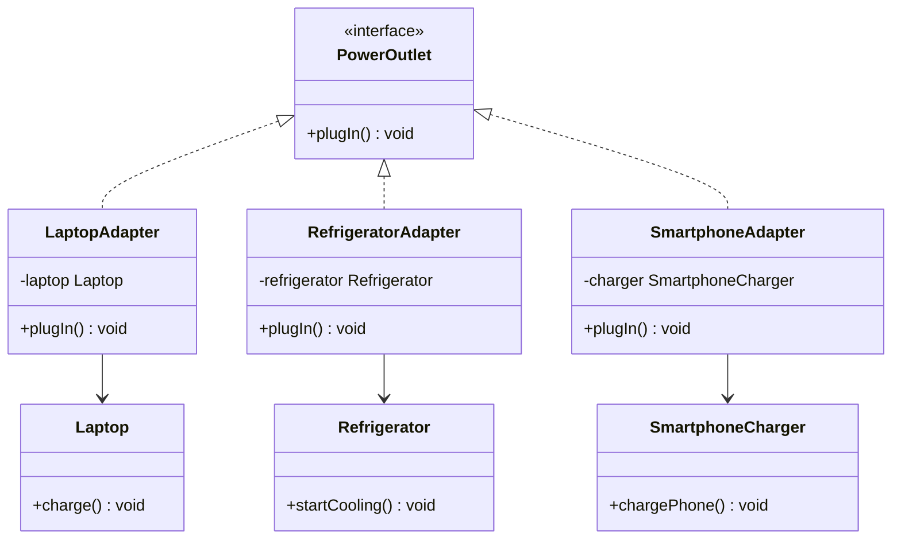

# Plugging Devices into Power Outlets

## Problem Statement

You are developing an application that helps users manage and control various electronic devices by plugging them into power outlets. Each device has different plug types, voltage, and amperage requirements. To ensure compatibility and safety, you need to create adapters for different devices to allow them to be plugged into standard power outlets.

* Adaptee Objects:
   * Laptop - Represents a laptop device that needs to be plugged into a power source. It has the charge() method.
   * Refrigerator - Represents a refrigerator device that requires a power source. It has the startCooling() method.
   * SmartphoneCharger - Represents a smartphone charger that needs to be plugged in for charging. It has the chargePhone() method.
* Target Object:
   * PowerOutlet - Represents a standard power outlet with a common interface for plugging in devices. It defines the plugIn() method as the target method.
* Adapter Objects:
   * LaptopAdapter - An adapter for plugging a laptop into a standard power outlet. It adapts the Laptop to the PowerOutlet interface, translating plugIn() to charge().
   * RefrigeratorAdapter - An adapter for plugging a refrigerator into a standard power outlet. It adapts the Refrigerator to the PowerOutlet interface, translating plugIn() to startCooling().
   * SmartphoneAdapter - An adapter for plugging a smartphone charger into a standard power outlet. It adapts the SmartphoneCharger to the PowerOutlet interface, translating plugIn() to chargePhone().

In your solution you must provide the following in your Github link account:

*   Problem statement (description of the problem. Just copy what is stated here.
*   UML Class Diagram
*   Uploaded java codes for the solution.

## UML Class Diagram



GitHub renders the diagram above automatically since it's inside a ```mermaid code block — no extra image file needed.

## Design Pattern Used

This is the **Adapter Pattern** (structural pattern). It lets classes with incompatible interfaces (`Laptop.charge()`, `Refrigerator.startCooling()`, `SmartphoneCharger.chargePhone()`) work together by wrapping each one in an adapter that implements the common `PowerOutlet.plugIn()` method. The client code only ever calls `plugIn()` — it never needs to know each device's real method name.

## Project Structure

```
PowerOutletAdapterPattern/
├── README.md
└── src/
    ├── PowerOutlet.java          # Target interface
    ├── Laptop.java                # Adaptee
    ├── Refrigerator.java          # Adaptee
    ├── SmartphoneCharger.java     # Adaptee
    ├── LaptopAdapter.java         # Adapter
    ├── RefrigeratorAdapter.java   # Adapter
    ├── SmartphoneAdapter.java     # Adapter
    └── Main.java                  # Client / demo
```

## How to Run

```bash
cd src
javac *.java
java Main
```

Expected output:
```
Laptop is charging...
Refrigerator is cooling...
Smartphone is charging...
```

## How to Push This to GitHub (so you have a link to submit)

1. Create a new repository on GitHub (e.g. `plugging-devices-adapter-pattern`) — don't initialize it with a README, since you already have one.
2. Unzip this folder, then open a terminal inside it.
3. Run:
   ```bash
   git init
   git add .
   git commit -m "Adapter pattern solution: plugging devices into power outlets"
   git branch -M main
   git remote add origin https://github.com/YOUR-USERNAME/YOUR-REPO-NAME.git
   git push -u origin main
   ```
4. Copy the repo URL from your browser (it'll look like `https://github.com/YOUR-USERNAME/YOUR-REPO-NAME`) and submit that as your GitHub Solution link.
